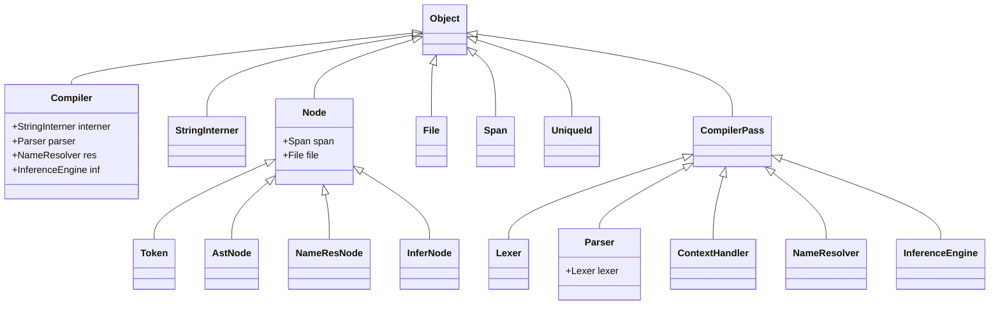

```mermaid
classDiagram
    Compiler : +StringInterner interner
    Compiler : +Parser parser
    Compiler : +NameResolver res
    Compiler : +InferenceEngine inf
    Object <|-- Compiler
    Object <|-- StringInterner
    Object <|-- Node
    Object <|-- File
    Object <|-- Span
    Object <|-- UniqueId
    Object <|-- CompilerPass

    CompilerPass <|-- Lexer
    CompilerPass <|-- Parser
    Parser : +Lexer lexer
    CompilerPass <|-- ContextHandler
    CompilerPass <|-- NameResolver
    CompilerPass <|-- InferenceEngine

    Node : +Span span
    Node : +File file
    Node <|-- Token
    Node <|-- AstNode
    Node <|-- NameResNode
    Node <|-- InferNode
```
