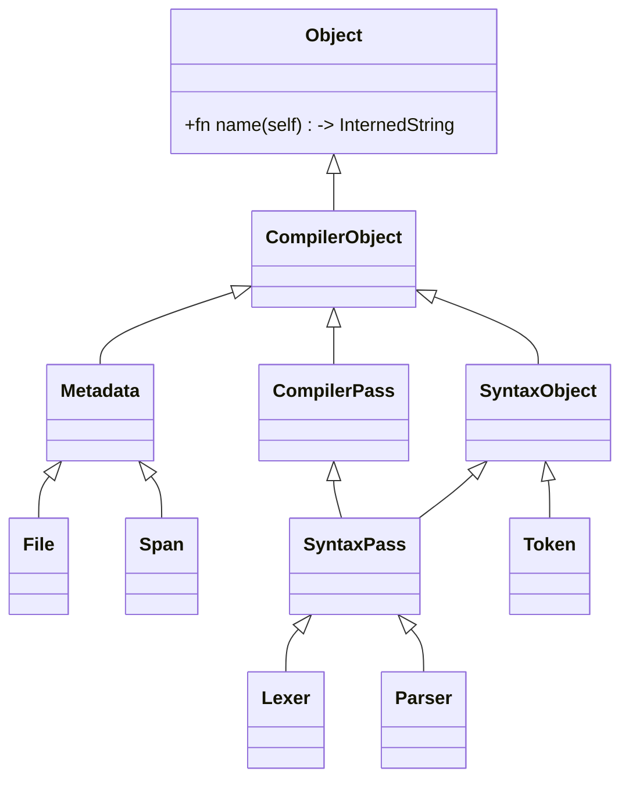

```mermaid
classDiagram
    class Object {
        +fn name(self) -> InternedString
    }
    Object <|-- CompilerObject
    CompilerObject <|-- Metadata
    Metadata <|-- File
    Metadata <|-- Span
    CompilerObject <|-- CompilerPass
    CompilerObject <|-- SyntaxObject
    CompilerPass <|-- SyntaxPass
    SyntaxObject <|-- SyntaxPass
    SyntaxObject <|-- Token
    SyntaxPass <|-- Lexer
    SyntaxPass <|-- Parser
```
